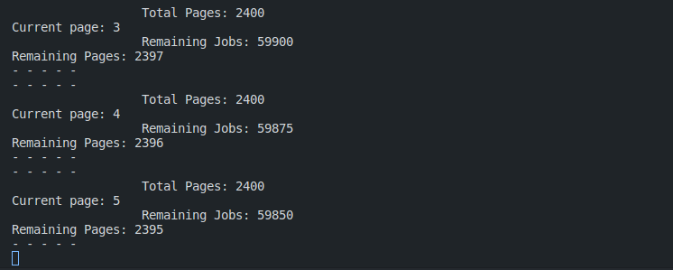
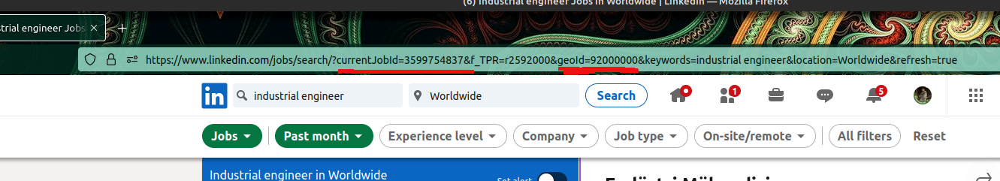

# LinkedIn Job Scraper
*Selenium based job finder & scraper.*




## Install

- *Clone the repository:*
```
git clone https://github.com/erkamesen/LinkedIn-Job-Scraper.git
```
- *Navigate to directory:*
```
cd LinkedIn-Job-Scraper/
```
- *Install the requirements*
```
pip install requirements.txt
```
&
```
pip3 install requirements.txt
```

## Usage

### Job Finder


⚠️⚠️⚠️
*You can get the **currentJobId** and **geoId** values ​​from the URL after making the search settings.*
⚠️⚠️⚠️

*You can review the sample CSV and JSON files and see how the data came in. If you want to change it, set it in job_finder.py.*

- *set your own driver settings in config.py !!!*
- *Create an object from the JobFinder class in main.py and set parameters* 
- *Start script with the run() method of the object you created.*
Parameters:
- **job_name** = *Enter the name of the job you are searching for*
-  **currentJobId** = *You can get it from URL after the set filter settings.* <br> Default = 3599754837
-  **geoId** = *You can get it from URL after the set filter settings.* <br> Default = 92000000
- **number_of_jobs** = *You can search for the job on LinkedIn and give this number directly. Otherwise, if the job count is high, selenium will take it in rounded number format.* <br> Default = None
- **location** = *Enter a location name to specify where to search for the job. If you want to search all over the world, the default value will do it.* <br> Default = "Worldwide"

```
finder = JobFinder(job_name="Python", currentJobId=3597224841, geoId=102105699, location="Turkey")

finder.run()
```
*Fetching datas will be collected under these columns:*
> 'COMPANY', 'TITLE', 'COMPANY_URL', 'LOCATION', 'BENEFIT', 'JOB_URL'
> 
### Job Scraper

*You can review the sample CSV and JSON files and see how the data came in. If you want to change it, set it in job_scraper.py.*
*You can use this scraper to fetch the details of the jobs.*

- *set your own driver settings in config.py !!!*
- *Create an object from the JobScraper class in main.py and set parameters* 
- *Start script with the run() method of the object you created.*
Parameters:
- **filename** = *It takes the filename as a parameter. (csv file)*
- *If you wish, you can create this file with the run() method of the JobFinder class.*
- *For job postings to check URLs and fetch datas, job postings should be grouped under the **JOB_URL** column in the csv file.*

```
scraper = JobScraper("1684835923.csv")

scraper.run()
```

*Fetching datas will be collected under these columns:*
> 'COMPANY', 'TITLE', 'COMPANY_URL', 'LOCATION', 'BENEFIT', 'JOB_URL','JOB_DESCRIPTION', 'COMPANY_IMAGE', 'APPLICANT_NUM', 'POSTED_TIME', 'SENIORITY_LEVEL', 'EMPLOYMENT_TYPE', 'JOB_FUNCTION', 'INDUSTRIES'

## Technologies

<div align=center>


<div>
